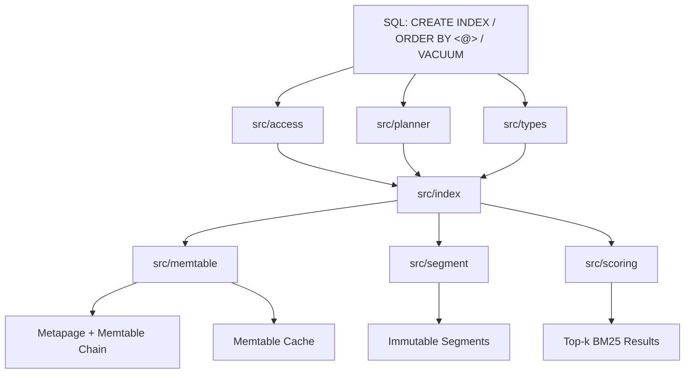

# pg_textsearch 整体架构分析与核心实现流程

本文档基于当前仓库中的源码、SQL 定义、设计文档和测试结构，对 pg_textsearch 的整体架构、核心模块职责和关键执行流程做统一分析。

## 1. 项目定位

pg_textsearch 是一个 PostgreSQL 扩展，向数据库暴露 `bm25` 索引访问方法以及 BM25 排序查询能力。它的目标不是复用 PostgreSQL 内置 `tsvector/tsquery` 的排序逻辑，而是在 PostgreSQL 的索引访问方法框架内，提供更适合信息检索场景的能力：

- 使用 BM25 而不是简单匹配打分
- 用 `ORDER BY content <@> 'query' LIMIT n` 这种 SQL 语法直接做相关性排序
- 通过 Block-Max WAND 实现 top-k 查询加速
- 支持 expression index、partial index、text[]、分区表
- 保持与 PostgreSQL WAL、崩溃恢复、物理复制兼容

从工程视角看，它是一个“PostgreSQL 接入层 + LSM 风格存储层 + BM25/BMW 排序执行层”的组合系统。

## 2. 总体分层

项目的层次划分在 [CONTRIBUTING.md](../CONTRIBUTING.md) 中有明确约定，当前代码大体可以归纳为四层。

### 2.1 Layer 1: PostgreSQL 接入层

- `src/access/`：实现 PostgreSQL Index Access Method API
- `src/types/`：实现 `bm25query`、`bm25vector` 及相关 SQL 函数/操作符
- `src/planner/`：实现 planner hook、索引解析和成本估算
- `sql/pg_textsearch--1.4.0-dev.sql`：定义 SQL 可见对象

这一层负责把 SQL 语义翻译为内部执行动作，例如：

- `CREATE ACCESS METHOD bm25`
- `CREATE OPERATOR <@>`
- `CREATE OPERATOR CLASS text_bm25_ops`
- `tp_build` / `tp_insert` / `tp_beginscan` / `tp_gettuple`

### 2.2 Layer 2: 索引协调层

- `src/index/`

这层负责跨后端、跨事务协调索引的共享状态，主要包括：

- metapage 的读取和升级
- index OID 到共享状态的 registry
- backend-local state 的附着与重建
- 读路径统一数据源抽象 `TpDataSource`
- 查询 limit 读取、索引解析等辅助逻辑

### 2.3 Layer 3: 存储层

- `src/memtable/`
- `src/segment/`

这是项目最关键的一层。

当前版本的设计重点是：

- **L0 source of truth**：索引关系内部的 on-disk memtable page chain
- **读取优化层**：可选的 shared-memory memtable cache
- **持久层**：不可变 segment，多层级组织，支持 merge/compaction/compression

这一设计在逻辑上接近 LSM：

- 新写入先进入 memtable chain
- 达到阈值后 spill 成 L0 segment
- 后续按 level 合并为更高层 segment

### 2.4 Layer 4: 排序与查询优化层

- `src/scoring/`

核心能力包括：

- BM25 打分公式
- 多源 doc_freq 聚合
- BM25 打分公式
- 单词、多词查询的 BMW 执行
- top-k 剪枝
- 多源 doc_freq 聚合
- BM25 打分公式- 单词、多词查询的 BMW 执行
- top-k 剪枝

## 3. 关键运行时对象

### 3.1 SQL 可见对象

在 `sql/pg_textsearch--1.4.0-dev.sql` 中，扩展定义了以下核心 SQL 对象：

- access method: `bm25`
- 数据类型：`bm25vector`、`bm25query`
- 查询构造函数：`to_bm25query(text)`、`to_bm25query(text, text)`
- 评分函数：
  - `bm25_text_bm25query_score`
  - `bm25_text_text_score`
  - `bm25_textarray_bm25query_score`
  - `bm25_textarray_text_score`
- 排序运算符：`<@>`
- operator class：
  - `text_bm25_ops`
  - `text_array_bm25_ops`
- 调试与维护函数：
  - `bm25_spill_index`
  - `bm25_force_merge`
  - `bm25_dump_index`
  - `bm25_summarize_index`

这些对象定义了 PostgreSQL 层看到的完整产品表面。

### 3.2 Metapage

`src/index/metapage.c` 管理 block 0，对整个索引的全局元数据做统一管理，包括：

- text search configuration OID
- 语料统计：`total_docs`、`total_len`
- 各层 segment 链表头 `level_heads[]`
- memtable chain 的 `memtable_head_blkno` / `memtable_tail_blkno`
- 索引格式版本

metapage 是索引存储布局的总入口，也是版本兼容和在线升级的重要锚点。

### 3.3 Shared Registry 与 Local State

`src/index/registry.c` 使用共享内存 + DSA + dshash 维护全局 registry，把 index OID 映射到共享状态。`src/index/state.c` 则负责当前 backend 如何附着到共享状态。

这里有两个层次：

- `TpSharedIndexState`：全局共享状态，跨 backend 可见
- `TpLocalIndexState`：backend-local 句柄，包含共享状态地址、锁状态、事务内计数等

这个分层的作用是：

- 让索引在多个 backend 中共享基础设施
- 允许 backend 在第一次访问时附着或从磁盘重建状态
- 提供 per-index lock、spill generation、cache 句柄等运行时协作信息

### 3.4 统一数据源抽象 `TpDataSource`

`src/index/source.h` 定义了统一的数据源接口，抽象出：

- `get_postings`
- `get_doc_length`
- `get_doc_freq`
- `close`

这样，评分层不需要关心 posting 来自：

- memtable chain
- memtable cache
- segment

而只需要面向统一接口读取 posting list 和文档长度。

### 3.5 On-disk Memtable Chain

`docs/memtable_v2.md` 与 `src/memtable/` 共同描述了当前写入层的核心设计：

- memtable 不再以共享内存哈希表作为 source of truth
- 而是直接把 doc record 以 page chain 形式写入 index relation
- 每次修改都通过 `GenericXLog` 做 WAL 记录
- spill 时再把 chain 物化为 segment

这个设计的核心价值是：

- 不需要自定义 rmgr
- PostgreSQL 原生 WAL replay 即可恢复
- 兼容 streaming replication 和 single-page redo

### 3.6 Memtable Cache

`docs/memtable_cache.md` 说明了当前读取优化层的定位：

- on-disk chain 是 source of truth
- cache 是 DSA 中的派生态 inverted index
- 写路径不更新 cache
- 读路径和 spill 路径按需把 cache catch up 到 chain tail
- cache 失效或丢失不会影响正确性，只会影响性能

因此，当前架构实际上是：

- 写入正确性依赖磁盘 chain
- 查询效率尽量走 cache
- cache 不可用时回退到 chain source

### 3.7 Segment

`src/segment/` 是不可变持久层，负责：

- term dictionary
- posting list 存储
- doc map
- alive bitset
- segment merge / compaction
- block compression
- segment format versioning

segment 是 top-k 查询真正长期依赖的数据层；memtable 只承担近期写入与 spill 前缓冲的角色。

## 4. 顶层架构图

## 5. 核心功能实现流程

下面按用户最关心的几个主流程来展开。

### 5.1 扩展加载与 SQL 注册流程

#### 第一步：共享库加载

`src/mod.c` 中的 `_PG_init()` 是扩展初始化入口。它做了几件关键事情：

- 检查扩展是否通过 `shared_preload_libraries` 加载
- 注册 GUC，例如：
  - `pg_textsearch.default_limit`
  - `pg_textsearch.bulk_load_threshold`
  - `pg_textsearch.memtable_pages_threshold`
  - `pg_textsearch.compress_segments`
  - `pg_textsearch.memtable_cache_enabled`
- 注册 registry 所需的 shared memory hook
- 注册事务回调、subxact 回调、object access hook、ProcessUtility hook
- 初始化 planner hooks

因此，`mod.c` 是整个扩展的系统接入点。

#### 第二步：SQL 文件注册访问方法与操作符

`sql/pg_textsearch--1.4.0-dev.sql` 中完成 SQL 面的装配：

- 把 `tp_handler` 暴露为 access method handler
- 创建 `bm25` access method
- 创建 `<@>` 运算符和 operator class
- 创建 `bm25query` / `bm25vector` 类型
- 创建 debug / spill / force_merge / summarize 等函数

#### 第三步：Access Method handler 装配函数指针

`src/access/handler.c` 中 `tp_handler()` 返回 `IndexAmRoutine`，把 PostgreSQL AM 框架所需的各个回调绑定起来：

- build: `tp_build`
- insert: `tp_insert`
- bulkdelete: `tp_bulkdelete`
- vacuumcleanup: `tp_vacuumcleanup`
- beginscan / rescan / gettuple / endscan
- cost estimate: `tp_costestimate`

至此，SQL 调用、planner、executor 与内部实现被打通。

### 5.2 CREATE INDEX 流程

#### 串行构建

`src/access/build.c` 中 `tp_build()` 是建索引总入口。串行模式下它主要分为以下步骤：

1. 读取 index options，解析 `text_config`、`k1`、`b`
2. 初始化 metapage
3. 通过 `table_index_build_scan()` 扫描 heap
4. 在 build callback 中对文本做分词和向量化
5. 将文档累积到 `TpBuildContext`
6. 到达内存预算后 flush 成 segment
7. 构建完成后把 `total_docs` / `total_len` 写回 metapage
8. 创建共享 index state，并从 build mode 切换到 runtime mode

这里的关键思想是：**建索引时直接构造 segment，而不是走运行时插入路径**。

#### 并行构建

`src/access/build_parallel.c` 的并行构建采用“worker 本地构建 + leader 单点合并”的模式：

1. leader 进入 parallel mode，建立 DSM 和 shared state
2. 每个 worker 扫描自己负责的 heap block range
3. worker 本地构造 `TpBuildContext`
4. worker 把局部结果写入 `BufFile`
5. 所有 worker 完成 Phase 1 后，由 leader 做一次 N-way merge
6. leader 直接写出最终 segment，并更新 metapage
7. 构建完成后创建运行时共享状态

这种设计避免了 worker 并发写最终 segment 的复杂同步问题，把最终持久化收敛到 leader。

### 5.3 INSERT / 写入 / Spill 流程

#### 写入入口：`tp_insert`

运行时写入由 `src/access/build.c` 中的 `tp_insert()` 处理。流程可以拆成两段：

##### 阶段 A：无锁分词

在真正获取 per-index lock 之前：

1. 读取索引字段值
2. 如为 `text[]` 则先 flatten
3. 调用 `to_tpvector` 做分词和向量化
4. 抽取 term、frequency、doc_length

这一步尽量放在无锁区，避免 CPU 密集分词操作阻塞并发写入。

##### 阶段 B：持锁写入 memtable chain

之后进入共享状态区：

1. 通过 `tp_get_local_index_state()` 获取 backend-local 索引状态
2. 获取 per-index lock
3. 把 doc record append 到 on-disk memtable chain
4. 更新统计信息和 chain page count
5. 释放共享锁
6. 再执行 auto-spill 检查；必要时升级到独占锁并 spill

#### Memtable Append

`docs/memtable_v2.md` 描述了 append 的几种情况：

- bootstrap：空链首次写入
- fast append：tail page 还能放下新 record
- extend：tail page 放不下，需要扩展新页
- fragment：单条 record 过大，需要 continuation page

所有这些修改都通过 `GenericXLog` 写入 WAL，因此 crash recovery 不依赖扩展自定义 redo 逻辑。

#### Auto Spill

`tp_auto_spill_if_needed()` 会基于 `chain_page_count` 和 `pg_textsearch.memtable_pages_threshold` 决定是否 spill。

spill 的核心实现是 `tp_do_spill()`：

1. 在持有 per-index `LW_EXCLUSIVE` 的前提下打开 chain source
2. 从 chain 提取 term dictionary 与 doc map
3. 调用 `tp_write_segment()` 生成新 L0 segment
4. `tp_spill_finalize()` 更新 metapage：
   - 清空 memtable head / tail
   - 把 segment 接到 level 0
   - 累加 `total_docs` / `total_len`
5. 把旧 chain 页标记为 DEAD，等待 vacuum 回收
6. 再根据 level policy 执行 `tp_maybe_compact_level()`

这里最重要的约束是：**先 finalize，再 mark dead**。这是 crash safety 的关键顺序，防止崩溃时仍可达的页被提前回收。

### 5.4 查询路径：ORDER BY BM25

这是项目最核心的用户可见能力。

#### 阶段 A：planner hook 识别 `<@>`

`src/planner/hooks.c` 做了两件大事：

1. 识别 `<@>` 运算符，解析这是 BM25 排序语义
2. 当用户没有显式指定索引时，自动为列寻找适配的 bm25 index

它还能处理一些重要细节：

- 跳过 partial index 的隐式解析，要求显式 `to_bm25query()`
- 对 expression / inheritance / partition 场景做额外索引解析
- 为 planner 提供更合理的成本模型，尽量把查询引导到 index scan
- 把某些 resjunk ORDER BY 评分表达式替换为 `bm25_get_current_score()`，避免重复计算

#### 阶段 B：scan 初始化

`src/access/scan.c`：

- `tp_beginscan()` 创建 scan context 和 scan opaque
- `tp_rescan()` 解析 order by key，提取 query text 或 `bm25query`
- `tp_rescan_process_orderby()` 负责把 query 保存到 scan state

#### 阶段 C：执行评分查询

真正的查询入口是 `tp_gettuple()`。

第一次取 tuple 时，如果尚未计算结果集，就调用 `tp_execute_scoring_query()`：

1. 获取 `TpLocalIndexState`
2. 先获取 per-index `LW_SHARED`
3. 在锁保护下读取 metapage，保证与 spill 不交错
4. 如果 query 还是纯文本，就调用 `to_tpvector` 把 query 文本转成向量
5. 调用 `tp_memtable_search()` 执行检索
6. 释放锁

随后 `tp_gettuple()` 按顺序返回结果，把 score 缓存在 backend-local 变量中，并通过 `bm25_get_current_score()` 暴露给 ORDER BY 重写逻辑。

#### 阶段 D：评分执行

`src/scoring/bm25.c` 中 `tp_score_documents()` 是统一评分主逻辑。

它的关键步骤是：

1. 从 metapage 读取 segment corpus totals
2. 通过 `tp_memtable_source_create_for_read()` 打开 memtable 数据源
3. 把 memtable 的 `total_docs` / `total_len` 叠加到 segment totals 上
4. 对 query term 计算统一 doc_freq 和 IDF
5. 对单词查询调用 `tp_score_single_term_bmw()`
6. 对多词查询调用 `tp_score_multi_term_bmw()`
7. 返回 top-k 文档 CTID 和 score

这里真正支撑性能的是 BMW，而不是简单的 posting list 全量扫描。

#### 阶段 E：memtable 读源选择

`src/memtable/cache_source.c` 中 `tp_memtable_source_create_for_read()` 负责决定：

- 优先尝试从 memtable cache 读
- 在以下情况直接回退 chain source：
  - `memtable_cache_enabled = off`
  - 处于 recovery
  - 当前 index state 处于 build mode
  - cache source 创建失败

这保证了：**cache 只是性能优化，不参与正确性判断**。

### 5.5 独立评分路径：非索引扫描 `<@>`

除了索引扫描路径外，`src/types/query.c` 中的 `bm25_text_bm25query_score()` 也支持按行独立计算 BM25 分数。

这个路径主要用于：

- standalone scoring
- 某些测试中的对照验证
- 不走标准索引 scan 的场景

其主要做法是：

1. 从 `bm25query` 取出 index OID
2. 打开 index relation，并根据需要处理 partitioned index / child index
3. 读取 metapage 和 memtable source
4. 对文档文本做 tokenization
5. 对 query 文本做 tokenization
6. 逐 term 查找 tf、doc_freq、idf
7. 按 BM25 公式累加分数

为了避免每行重复打开 segment 造成灾难性开销，这条路径在 `fn_extra` 中缓存 per-query IDF 信息。

因此，这个函数功能完整，但成本高；项目更推荐用户通过 `ORDER BY ... LIMIT` 触发真正的索引扫描路径。

### 5.6 VACUUM / 删除 / 清理流程

`src/access/vacuum.c` 负责索引维护，主要问题有两个：

1. 如何处理段中的 dead documents
2. 如何回收 spill 后已经断开的 dead memtable pages

当前实现的关键点：

- 通过 `alive_bitset` 标记 segment 中哪些文档仍然存活
- `tp_count_live_docs()` 统计 live tuple 数，而不是简单使用 metapage 的 `total_docs`
- `tp_apply_vacuum_shrinkage()` 在 vacuum 后修正 metapage 统计
- `tp_collect_reachable_chain_blocks()` 构建仍然可达的 memtable page 集合，避免误回收
- `tp_spill_memtable_if_needed()` 在 vacuum 或 shutdown 场景下触发受控 spill，减少 runt chain

这一层的设计说明项目并不把“删除后重建整个 segment”作为唯一手段，而是先用位图做逻辑删除，再在 merge/compaction 阶段做物理清理。

### 5.7 崩溃恢复、WAL 与物理复制

这是 pg_textsearch 相比早期方案最大的架构调整之一。

根据 `docs/memtable_v2.md` 和当前实现：

- memtable source of truth 已改为 on-disk page chain
- 每次页修改通过 `GenericXLog` 进入 WAL
- replay 由 PostgreSQL 原生机制完成
- 不需要自定义 rmgr
- standby 不需要加载扩展代码即可完成页面级恢复

这带来几项重要收益：

- crash 后不需要重建共享内存 memtable
- streaming replication 可直接复制页修改
- single-page redo 兼容性更好

同时，这也是为什么 `tp_memtable_source_create_for_read()` 在 recovery 中直接禁用 cache，而改走 chain source：standby 上的 cache 不是 WAL 回放对象，不能当作权威数据来源。

### 5.8 Debug / 运维 / 可观测性

项目提供了较丰富的调试与运维接口：

- `bm25_dump_index()`：查看内部结构
- `bm25_summarize_index()`：输出高层统计
- `bm25_spill_index()`：手工触发 spill
- `bm25_force_merge()`：强制段合并
- `pg_textsearch.log_scores`：记录返回分数
- `pg_textsearch.log_bmw_stats`：记录 BMW 统计
- `pg_textsearch.log_cache_state`：记录 cache 路径选择

这说明项目在实现上不只是关注功能正确性，也考虑了性能验证和问题定位。

## 6. 测试体系与工程配套

`test/README.md` 和仓库结构展示出两层测试体系：

### 6.1 SQL 回归测试

- 位于 `test/sql/`
- 对应输出位于 `test/expected/`
- 覆盖类型、索引构建、查询、恢复、边界条件等

### 6.2 Shell 集成测试

- 位于 `test/scripts/`
- 覆盖并发、崩溃恢复、复制、故障切换、压力测试

这类测试对该项目特别重要，因为它的核心价值点并不只是 SQL 功能，而是：

- 并发写入正确性
- spill / merge 的一致性
- crash recovery 正确性
- replication 行为

因此，这个项目的测试架构本身也是其设计的一部分。

## 7. 关键设计约束与不变量

综合源码和设计文档，可以总结出当前实现依赖的几个核心不变量。

### 7.1 On-disk memtable chain 是写入真相源

cache 不是 source of truth，segment 也不是最近写入的唯一来源；最近写入首先存在于 chain 中。

### 7.2 Cache 只是派生态

cache 可以被丢弃、重建、回退，不影响结果正确性，只影响查询性能。

### 7.3 Spill 必须在 per-index EXCLUSIVE 锁下完成

因为 spill 同时涉及：

- 读取 chain
- 写 segment
- 改写 metapage
- 切断 memtable chain

所以 spill 是索引级排它操作。

### 7.4 查询必须在一致快照下读取 metapage 与 memtable

`tp_execute_scoring_query()` 先加 shared lock，再读 metapage，是为了避免 query 与 spill 看到不一致状态。

### 7.5 语料统计由 segment totals + 活跃 memtable totals 共同构成

查询时总文档数与总长度不能只依赖 segment，也不能只依赖共享内存原子计数，而是要以 metapage 持久值为基础，再叠加当前 memtable source。

### 7.6 top-k 性能依赖 BMW，而不是顺序遍历

如果没有 BMW，BM25 在 PostgreSQL 中做大规模排序查询的成本会迅速失控。`src/scoring/` 是这个项目性能竞争力的核心。

## 8. 代码结构中的几个重要观察

### 8.1 命名上仍保留 Tapir 痕迹

虽然 SQL 面统一使用 `pg_textsearch` / `bm25`，但内部函数前缀大量使用 `tp_`，这反映了项目的历史名称 Tapir。

### 8.2 文档存在“旧分层描述”和“新实现现实”并存的情况

例如：

- `CONTRIBUTING.md` 中的 Layer 3 仍把 `memtable/` 描述成“in-memory inverted index”
- 但 `docs/memtable_v2.md` 和当前代码表明，source of truth 已经转为 on-disk memtable chain
- `docs/memtable_cache.md` 又把 shared-memory inverted index 重新引入为 cache，而非权威存储

因此，理解当前架构时应以 `memtable_v2.md`、`memtable_cache.md` 和实际源码为准，而不是只看旧的层描述。

### 8.3 运行时路径与构建路径是明确分离的

项目没有把 `CREATE INDEX` 简单复用成大量调用 `tp_insert()`，而是维护了单独的 build path 和 parallel build path。这是合理的，因为：

- 构建阶段强调吞吐
- 运行时插入强调并发与 WAL 正确性
- 两者对内存、锁和持久化组织的要求不同

## 9. 一句话总结

pg_textsearch 当前的本质，是一个把 PostgreSQL BM25 排序、LSM 风格 segment 存储、on-disk memtable、shared-memory 派生 cache，以及 BMW top-k 优化组合在一起的全文检索扩展。

如果只抓最核心的一条主线，可以概括为：

1. SQL `<@>` 被 planner 和 access method 接住
2. 查询通过统一 posting source 聚合 memtable 与 segments
3. 打分逻辑用 BM25，执行优化用 BMW
4. 新写入先进入 on-disk memtable chain
5. chain 到阈值后 spill 成 segment
6. 所有页级持久化依赖 PostgreSQL 原生 WAL / recovery / replication 机制

这套设计把 PostgreSQL 扩展模型、信息检索排序模型和数据库可恢复性要求比较完整地结合到了一起。

-------------------

在这个项目里，`spill` 的意思是：

把当前累积在 memtable（内存/链式暂存层）里的索引数据，刷写成一个新的磁盘 segment（通常是 L0 段）。

你可以把它理解成“落盘切段”动作。

结合 pg_textsearch 的流程就是：

1. 插入/更新文档时，先写入 memtable（不是立刻改多个历史 segment）。
2. 当达到阈值（比如页数、批量阈值）或手动触发时，执行 `spill`。
3. `spill` 会把这批 memtable 数据整理并写成新 segment。
4. 写完后重置/切换 memtable 链，后续新写入继续进入新的活动 memtable。
5. 之后再由 compaction/merge 把多个 segment 合并到更高层。

所以你在文档里看到的 `spill`，本质就是“把增量写入批次从 memtable 转成磁盘段”的阶段。

Starting: *List BM25 statistics storage locations.* (15/31)

--------------------------

posting存储
我先把“posting 具体字段”和“页内分区布局”两部分从源码对齐出来，再给你一版按页面类型拆解的详细说明。

Searched for regex `typedef struct TpBlockPosting|TpDictEntry|TpSkipEntry|postings_offset|page_index|ctid_pages_offset|ctid_offsets_offset|fieldnorm_offset` (`**/src/segment/**`), 80 results

Read , lines 1 to 260

Read 

Read 

Read , lines 1 to 260

我再补齐 posting 结构体的完整字段和压缩块布局，然后把“每类页面里放什么”按从页头到数据区讲清楚。

Read , lines 240 to 277

Read 

Read , lines 940 to 1010

Read , lines 60 to 170

我再补一段“物理页面如何标识类型（header/page-index/data）”的实现证据，这样你可以看到不是文档推测。

Searched for regex `TP_PAGE_SEGMENT_HEADER|TP_PAGE_FILE_INDEX|TP_PAGE_DATA|page_type|TpPageSpecial|TP_SEGMENT_PAGE_MAGIC` (`**/src/segment/**`), 11 results

Read , lines 1080 to 1285

Updated todo list

我发现没有 src/segment/io.c 这个文件，写路径在 segment.c 里；我继续补完后半段（字典回填和 page index 写入）再给你完整图。

Read , lines 1285 to 1425

Read , lines 840 to 920

你这个问题非常好，答案分两层看最清楚：

1. 现在 posting 里到底存了什么  
2. 这些数据在页里是怎么放的

下面按源码来拆。

**Posting 现在存了什么**
先说结论：当前项目的 posting 是“文档级倒排”，没有词位置列表，所以不能原生做短语精确匹配。

每一层数据如下。

1. 词级元数据（每个 term 一条）
在 format.h 的 TpDictEntry：
- skip_index_offset：该词对应 skip 数组的起始偏移
- block_count：该词有多少 posting block
- doc_freq：该词文档频次（BM25 的 df）

2. 块级元数据（每个 block 一条）
在 format.h 的 TpSkipEntry：
- last_doc_id：该块最后一个 doc_id
- doc_count：块内文档数（最多 128）
- block_max_tf：块内最大词频（BMW 上界用）
- block_max_norm：块内最短文档对应 norm（BMW 上界用）
- posting_offset：该块 posting 数据偏移
- flags：块压缩方式标记（压缩/非压缩）

3. 文档级 posting（每个 term 在每个 doc 一条）
在 format.h 的 TpBlockPosting：
- doc_id：段内文档 id（不是 CTID）
- frequency：该词在文档中的词频 tf
- fieldnorm：量化后的文档长度信息
- reserved：对齐保留位

4. 与 posting 分离存储的映射/统计
在 format.h 的段头偏移字段里能看到：
- fieldnorm_offset：整段 fieldnorm 表
- ctid_pages_offset + ctid_offsets_offset：doc_id 到 CTID 的映射表
- alive_bitset_offset（V5）：存活位图（VACUUM 标死文档）
- num_docs、num_terms、total_tokens：段级统计

补充一点：虽然 TpBlockPosting 里有 fieldnorm，但段里仍有独立 fieldnorm 表，写段流程在 segment.c 之后也明确写了 fieldnorm 和 CTID 映射。

**页存储内容（Page-level）**
这个项目的 segment 逻辑上是一个“逻辑文件”，再映射到多个 PostgreSQL 页。

页面类型定义在 format.h：
- TP_PAGE_SEGMENT_HEADER：段头页
- TP_PAGE_FILE_INDEX：页索引页
- TP_PAGE_DATA：数据页

**1) 段头页（逻辑页 0）**
段头结构在 format.h。它存的是整段目录：
- 各数据区 offset（dictionary、strings、entries、postings、skip、fieldnorm、ctid map、alive bitset）
- 段级统计
- page_index 根页号

**2) 页索引页（Page Index）**
页索引页 special 区结构在 format.h。  
写入逻辑在 segment.c：
- special 里写 magic/version/page_type/next_page/num_entries
- 数据区写一串 BlockNumber，把“逻辑页号 -> 物理块号”映射起来
- 多个页索引页通过 next_page 串起来

**3) 数据页（真正放倒排数据）**
数据页本质是按段头 offset 切分的连续字节区。  
分类逻辑在 dump.c：
- postings_offset 之前：dictionary 区
- postings_offset 到 skip_index_offset：posting 区
- skip_index_offset 到 fieldnorm_offset：skip 区
- fieldnorm_offset 之后：docmap 区（fieldnorm、ctid pages、ctid offsets、alive bitset 等）

你可以把它理解成：
- 词典告诉你 term 在哪
- skip 告诉你 block 在哪、上界多大
- posting 给你 doc_id/tf/norm
- docmap 再把 doc_id 还原成 CTID

**和 memtable 页的关系**
你问的是 posting 和页存储，我再补一条容易混淆的点：
- memtable 页格式在 page.h
- 它存的是文档记录（ctid + doc_length + vector bytes），不是 segment 的 block posting 结构
- 只有 spill 后才写成上面讲的 segment posting/skip/dict 这些结构（见 segment.c）

如果你愿意，我可以下一步给你画一张“term 查询时从 dictionary -> skip -> posting -> CTID map”的单次读取路径图，直接对应这几个 offset 区域。

Completed: *List BM25 statistics storage locations.* (15/24)
